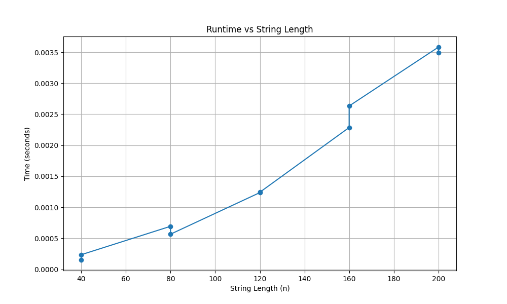

# Highest Value Longest Common Subsequence (HVLCS)

## Team
- Alejandro Wakszol (UFID: 42739040)
- Kaden Luangsouphom (UFID: 89641011)

## Description
Given two strings A and B over a fixed alphabet with character values, this program computes a common subsequence that maximizes the total value and outputs both the maximum value and the subsequence.

## Build / Run
No compilation needed (Python 3).

```bash
python src/main.py < <input_file>
```

### Example
```bash
python src/main.py < data/example.in
```

Expected output (in terminal):
```
9
cb
```

## Input Format
```
K
x1 v1
x2 v2
...
xK vK
A
B
```
- `K`: number of characters in the alphabet
- Each of the next K lines: a character and its integer value
- `A`: first string
- `B`: second string

## Output Format
- Line 1: the maximum value of a common subsequence
- Line 2: one optimal common subsequence achieving that value

## Example Files
- Input: [`data/example.in`](data/example.in)
- Output: [`data/example.out`](data/example.out)

## Assumptions
- Input files follow the format described above.
- Character values are nonnegative integers.
- Strings contain only characters defined in the alphabet.

## Questions

### Question 1: Empirical Comparison


### Question 2: Recurrence Equation
* Base Cases:
  - when either string A or string B has a length of 0, you cannot match anything and therefore the value of the common subsequence is 0
  - the base cases are handled automatically in our code when we initialize the entire DP table to 0
```
dp[0][j] = 0 for all j
dp[i][0] = 0 for all i
```

* Recurrence:
  - we know that this is a binary choice DP, either there is a match or there is no match
  - the recurrence equation below is correct for the following reasons:
    - when a[i] = b[j], a matching character can only increase or maintain our total value (it's non-negative), so it is always the right move. We take whatever the best solution was before both of these characters and add the value of the matched character.
    - when a[i] != b[j], we cannot match both characters at this position, so we skip whichever one leads to the worse result and carry forward the better of the two options
```
dp[i][j] = dp[i-1][j-1] + v(a[i])        if a[i] = b[j]
dp[i][j] = max(dp[i-1][j], dp[i][j-1])   if a[i] != b[j]
```

### Question 3: Big-Oh
*TODO*
